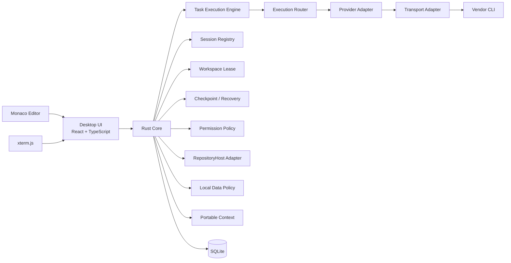

# AI CLI Orchestrator

複数のAIコーディングCLIを、1つのデスクトップUIから切り替え・再開・監視できる開発オーケストレーターです。

> Status: **設計 / 初期実装フェーズ**
>
> 現時点ではMVP仕様をIssueで整理している段階です。README内の「予定」「MVP」は未実装機能を含みます。

## 背景

Codex、Claude Code、Grok、Google Antigravityなど、複数のAIコーディングCLIを併用すると、以下が開発効率のボトルネックになります。

- 5時間枠・週次枠・クレジット等の利用制限
- 認証切れ、契約停止、課金状態、サービス障害
- CLIごとのセッション管理方法の違い
- 利用上限到達時の手動切り替え
- ターミナル中心の操作による視認性の低さ
- CLIごとに分断された作業履歴

AI CLI Orchestratorは、これらを統合し、**作業を止めずに次の利用可能なCLIへ切り替える**ことを目的とします。

## 目標

- macOS / Windowsで動作するデスクトップUI
- Codex / Claude Code / Grok / Google Antigravityの統合
- CLIごとの優先順位設定
- Task単位のsession identityと実行状態管理
- Single Writer + external edit conflict control
- Gitなしworkspaceでもcheckpoint / crash recovery
- local historyのretention / redaction / deletion
- 利用可能性・quota・認証状態・障害を考慮した自動切り替え
- 各CLIのネイティブなresume / continue機能を優先利用
- CLI切り替え時のPortable Context Handoff
- Chat / Editor / Terminal / Provider Statusの統合表示
- Gitがないフォルダでも利用可能
- GitHub repository検出時はIssue + PRワークフローを自動支援
- Git worktreeに依存しない通常branch運用

## 対象CLI

| Provider | CLI | Session継続 | 方針 |
|---|---|---|---|
| OpenAI | Codex CLI | resume / thread resume | ネイティブセッションを優先 |
| Anthropic | Claude Code | resume / continue | ネイティブセッションを優先 |
| xAI | Grok CLI | --resume / --continue | ネイティブセッションを優先 |
| Google | Antigravity CLI | --conversation / --continue | ネイティブセッションを優先 |

CLIの仕様差分はCoreへ直接埋め込まず、Provider Adapterで吸収します。

## なぜresumeを重視するのか

同じProviderへ戻るたびに会話を要約して渡し直すと、コンテキスト欠落、追加トークン消費、再解析コストが発生します。

そのため同一Providerでは、可能な限りそのCLI自身が持つセッションIDを保存し、ネイティブresumeを使います。

別Providerへ切り替える場合のみ、必要最小限の作業状態をPortable Context Envelopeとして再構成します。

### Portable Context Envelope

予定している内容:

- user goal
- accepted plan
- completed tasks
- pending tasks
- relevant files
- diagnostics
- recent command results
- previous provider
- switch reason
- safety / permission state
- optional git status / diff

Git情報はGit repositoryの場合だけ含めます。

## Workspace Mode

### Local Workspace Mode

Git repositoryでなくても利用できます。

予定機能:

- 任意フォルダを開く
- Unified Chat
- Monaco Editor
- Integrated Terminal
- Task管理
- CLI session resume
- Provider自動切り替え
- SQLiteによる履歴保存

Git初期化は要求しません。

### Repository Mode

Git repositoryを検出した場合のみ追加機能を有効にします。

- branch管理
- git status / diff
- GitHub remote検出
- Issue / PR支援
- review workflow

**git worktreeは使用しません。**

## GitHub Repository Workflow

GitHub repository上の開発タスクでは、IssueとPRをワンセットにすることを既定ワークフローとします。

1. 既存Issue確認
2. Issue作成
3. 基本設計
4. 詳細設計
5. 通常branch作成
6. 実装
7. test / lint / build
8. 敵対レビュー
9. PR作成
10. review / fix
11. merge準備

Repositoryがない場合、このフローは強制せずLocal Workspace Modeとして動作します。

## Routing

Provider選択は単純なラウンドロビンではなく、以下を考慮します。

- user priority
- provider enabled / disabled
- CLI availability
- authentication state
- billing state
- quota state
- health
- cooldown
- circuit breaker
- task capability
- current session resumability

想定状態:

- available
- degraded
- quota_exhausted
- auth_required
- billing_blocked
- unavailable
- disabled
- unknown

`unknown`を無条件に`available`として扱わない設計にします。

## Failover

Provider切り替えは、単純に同じ命令を再送するだけではありません。

ファイル変更、コマンド実行、外部操作などの副作用が発生した後に自動再実行すると、二重変更や破壊的操作につながるためです。

MVPでは以下を基本方針とします。

- read-only処理: 安全な範囲で自動再試行
- transient error: bounded retry後にfailover
- quota exhaustion: 次Providerへ
- auth / billing: 自動再試行しない
- destructive / write side effect後: 状態確認後に継続
- provider switch: Portable Context Envelopeを生成
- exit code 0でもtool/permissionがsoft-denyされた場合は成功扱いしない

## Architecture

## 技術スタック

MVP予定:

- Desktop: Tauri 2
- Frontend: React + TypeScript
- Editor: Monaco Editor
- Terminal: xterm.js
- Core: Rust
- Local DB: SQLite
- CLI Integration: Provider Adapter + Transport Adapter（official protocol / structured stream / headless process / PTY fallback）
- CI: GitHub Actions
- Platforms: macOS / Windows

採用技術はADRで確定させます。

## Security

基本方針:

- APIキーやアクセストークンを独自DBへ保存しない
- 各CLIの公式認証ストアを尊重する
- shell文字列連結ではなく引数配列でプロセス起動
- path traversal / symlink / malicious workspaceを考慮
- secretをログへ残さない
- CLIのsandbox / permission / allow / deny設定を尊重
- Provider切り替え時の副作用重複を防止
- 無制限なchild process生成を防止
- 危険な自動承認を既定にしない

## Design Documents

- [基本設計](docs/basic-design.md)
- [詳細設計](docs/detailed-design.md)
- [敵対レビュー基準](docs/adversarial-review.md)
- [CONTRIBUTING](CONTRIBUTING.md)
- [GitHub Development Workflow](docs/development-workflow.md)
- [Licensing Policy](docs/licensing.md)
- [MVP Issue Consistency Audit](docs/issue-audit.md)
- [ADR-0001 Desktop Stack](docs/adr/0001-desktop-stack.md)
- [ADR-0002 Provider Adapter](docs/adr/0002-provider-adapter.md)
- [ADR-0003 Native Resume First](docs/adr/0003-session-resume.md)
- [ADR-0004 Git Optional Workspace](docs/adr/0004-workspace-git-optional.md)
- [ADR-0005 Single Writer](docs/adr/0005-single-writer.md)
- [ADR-0006 Transport Abstraction](docs/adr/0006-transport.md)
- [ADR-0007 Unified Permission Policy](docs/adr/0007-permission-policy.md)
- [ADR-0008 Project Layout and Toolchain](docs/adr/0008-project-layout-toolchain.md)
- [ADR-0009 Typed Frontend/Core Protocol](docs/adr/0009-typed-frontend-core-protocol.md)

## MVP Issues

- #1 Multi-CLI AI IDE Orchestrator MVP
- #2 基本設計・詳細設計・ADR
- #3 Native Resume Registry / Session切替
- #4 Router / Quota / Health / Failover
- #5 Codex / Claude / Grok / Antigravity Adapter
- #6 Desktop UI
- #7 Local Workspace + GitHub Repository Workflow
- #8 SQLite / Portable Context Handoff
- #9 macOS / Windows Build・CLI検出・CI
- #10 Security / Test / 敵対レビュー
- #11 README
- #13 Session Identity / Resume Validation
- #14 Single Writer Lock
- #15 Transport Abstraction
- #16 Non-Git Checkpoint / Crash Recovery
- #17 Unified Permission / Sandbox Policy
- #19 GitHub Issue/PR Workflow & Templates
- #25 MVP Issue整合性・敵対レビュー監査
- #26 Task Execution Engine / Lifecycle
- #27 Local Data Privacy / Retention
- #28 GitHub Repository Host Adapter
- #29 Release Distribution / Signing / SBOM
- #30 Application Bootstrap / Workspace Layout

## 開発ルール

このrepository自身の開発では、原則として以下を必須とします。

- Issue
- 基本設計
- 詳細設計
- branch
- test
- 敵対レビュー
- PR
- 事実ベースの仕様確認
- 最新安定版との互換性確認

空repositoryを初期化してPRのbase branchを作るための最初のbootstrap commitのみ例外です。

## 公式仕様の確認先

仕様変更が頻繁なため、Provider Adapter実装時は必ず公式情報を再確認します。

- OpenAI Codex: https://developers.openai.com/
- Anthropic Claude Code: https://docs.anthropic.com/en/docs/claude-code/
- xAI Grok CLI: https://docs.x.ai/build/cli/
- Google Antigravity CLI: https://antigravity.google/docs/cli/

## License

AI CLI Orchestrator is licensed under the **Apache License, Version 2.0** (`Apache-2.0`).

- [LICENSE](LICENSE)
- [NOTICE](NOTICE)
- [Licensing Policy](docs/licensing.md)

このライセンスは本プロジェクト自身のコード・資料等に適用されます。Codex / Claude Code / Grok / Google Antigravityなどの第三者CLI、API、依存ライブラリ、商標は、それぞれの提供元のライセンス・利用規約・商標ポリシーに従います。

## Current Status

基本設計・詳細設計・ADR・Issue監査をmainへ集約し、P0実装前の整合性確認を完了する段階です。実装は #30 → #13/#15/#17 → #26/#14/#16 → #4/#5/#3 → #8/#27 → #28/#7/#6/#9 の依存順を基本とします。
