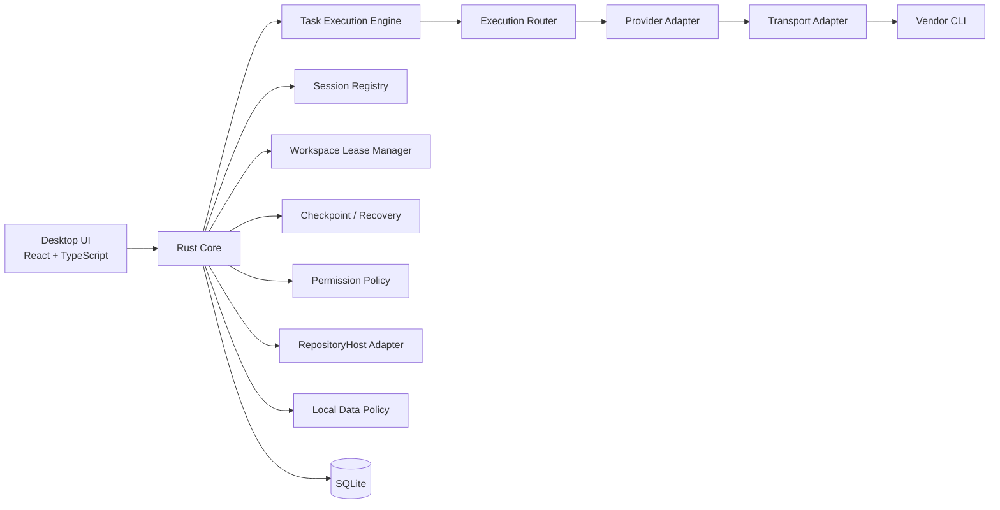

# 基本設計

Issue: #2  
Parent Epic: #1  
Status: Accepted for MVP  
Updated: 2026-10-07

## 1. 目的

AI CLI Orchestratorは、Codex / Claude Code / Grok / Google Antigravity等の複数AIコーディングCLIを、macOS / Windows上の単一デスクトップUIから利用するためのローカルオーケストレーターである。

主目的は以下。

- Providerごとの利用上限・認証・課金・障害で作業を止めない
- 各CLIのnative resume/continueを優先してコンテキスト再構築コストを減らす
- Git repositoryがなくても利用できる
- GitHub repositoryではIssue + 設計 + branch + 実装 + test + 敵対レビュー + PRを既定フローにする
- git worktreeを使用しない
- 複数Providerを安全に切り替え、同一workspaceへの競合書き込みを防ぐ

## 2. 非目標

MVPでは以下を必須としない。

- クラウド上の独自Agent実行基盤
- 独自API key proxy
- Provider認証情報の集中保存
- Git worktreeベースの並列編集
- 完全なVS Code互換Extension API
- Linux正式サポート
- 複数workspace root同時編集

## 3. システム構成



## 4. レイヤ

### 4.1 Desktop UI

責務:
- Chat
- Editor
- Terminal
- Task
- Provider status
- Session picker
- Routing decision表示
- Permission表示
- GitHub Issue / PR panel（Repository Modeのみ）

### 4.2 Core

責務:
- Workspace / Task lifecycle
- Run state machine / cancellation / reroute / idempotency
- Provider routing
- Session identity
- Workspace lock
- Recovery
- Permission normalization
- Audit log
- persistence
- RepositoryHost coordination
- local data retention/redaction/deletion coordination

CoreはProvider固有のコマンドライン文字列やJSON schemaへ依存しない。

### 4.3 Provider Adapter

Provider固有責務:
- CLI検出
- version probe
- auth probe
- capability probe
- new session
- resume / continue
- cancel
- model / effort mapping
- quota probe
- failure classificationのProvider固有補助

### 4.4 Transport Adapter

安定性の高い順に選択する。

1. Native / app protocol
2. Persistent structured stream
3. Headless JSON process
4. PTY interactive fallback

Provider AdapterとTransport Adapterを分離する。

### 4.5 Task Execution Engine

責務:
- Task / Run state machine
- cancellation / interrupt
- bounded retry / reroute
- side-effect idempotency guard
- incomplete run reconciliation

### 4.6 RepositoryHost Adapter

GitHub等のremote host integrationをGit/Coreから分離する。GitHub認証やAPI障害がLocal Workspace Modeを停止させてはならない。

### 4.7 Local Data Policy

SQLite、logs、raw events、checkpointsに保存されるcode/prompt/path等を機密データとして扱い、retention / redaction / deletionをCore policyとして管理する。

## 5. Workspace Mode

### 5.1 Local Workspace Mode

Git不要。

- 任意フォルダを開く
- Chat
- Editor
- Terminal
- Task
- Session resume
- Provider switch
- local checkpoint / recovery

### 5.2 Repository Mode

Git repository検出時のみ追加。

- branch/status/diff
- remote detection
- GitHub workflow
- PR review支援

git worktreeは使用しない。

## 6. Repository Workflow

GitHub remoteを検出した開発taskの既定フロー:

1. Issue検索
2. Issue作成
3. 基本設計
4. 詳細設計
5. 通常branch作成
6. 実装
7. test/lint/build
8. 敵対レビュー
9. PR
10. fix/review
11. merge準備

自動作成・自動mergeはRepository Policyで制御可能にする。

## 7. Sessionモデル

単位:

```text
Workspace
 └─ Task
     └─ Provider
         └─ ProviderSession[]
```

同一Provider:
- native resumeを優先
- 不要な要約をしない

Provider変更:
- Portable Context Envelopeを生成
- 元Provider sessionは保持

Session resume前に検証:
- cwd
- workspace identity
- file fingerprint
- Gitの場合 branch / HEAD
- provider version / capability

## 8. Concurrency

git worktreeを使わないためSingle Writerを採用。

- workspaceごとにWRITE leaseは原則1
- READ ONLY agentは並列可能
- Review agentはREAD ONLYで別Provider並列可能
- failover時は旧writer停止確認後にlease移譲
- crash時はstale lease回収

## 9. Router

Routing input:
- provider enabled
- binary availability
- auth
- billing
- quota
- health
- cooldown
- task capability
- permission compatibility
- resumability
- user priority
- model / effort
- estimated switching cost

Routing targetはProviderだけではなく以下。

```text
ExecutionTarget {
  provider
  model?
  effort?
  transport
  session?
}
```

## 10. Failure分類

Core分類:
- task_error
- tool_error
- provider_error
- quota_error
- auth_error
- billing_error
- transport_error
- permission_error
- cancelled
- unknown

「test失敗」をProvider障害と誤認しない。process exit codeだけで成功判定せず、structured event / tool result / permission denial noticeも評価する。

## 11. Failover

自動failover可能:
- quota exhausted
- transient provider/transport failure
- provider unavailable

原則停止:
- auth
- billing
- permission mismatch
- destructive side effect後で状態未確認
- ambiguous task failure

副作用後はcheckpoint / filesystem / optional Git diffを確認してから継続。

## 12. Permission

共通permission:
- read
- workspace_write
- command_execute
- network
- external_path
- destructive
- secret_access
- repository_write
- remote_action

Providerへ変換するとき、権限を暗黙に拡大しない。

## 13. Recovery

Gitなしでも復元可能にする。

- write前snapshot / patch journal
- atomic replace
- interrupted operation journal
- process group tracking
- orphan cleanup
- restore preview

Git repoではGitを利用できるが、Coreの復元性をGitだけに依存させない。

## 14. Persistence

SQLite主要entity:
- workspace
- task
- provider
- provider_session
- execution_run
- normalized_event
- routing_decision
- health_snapshot
- checkpoint
- workspace_lease
- permission_policy
- user_setting
- repository_host_link
- schema_migration

API keys / tokensは保存しない。prompt/code/command output/checkpoint等も機密情報を含み得るため、retention/redaction/deletionは#27で定義する。

## 15. OS

### macOS
- GUI launch時PATH差異に対応
- login shell環境の取得手段を用意
- Apple Silicon / Intel
- signing / notarization / secure updater / SBOMは#29のrelease phaseで追加

### Windows
- path separator / Unicode / space
- ConPTY
- PowerShell / cmd差異
- process tree termination
- Windows nativeとWSLをExecution Environmentとして分離可能にする

## 16. 更新戦略

Provider CLIは変化が速いため:
- version hardcodeを最小化
- capability probeを優先
- unsupported version warning
- fixturesでoutput parserを回帰テスト
- 実装時は各公式仕様の最新版を再確認

## 17. 関連Issue

- #3 Native Resume
- #4 Router / Quota / Failover
- #5 Provider Adapter
- #7 Workspace / GitHub Workflow
- #10 Security / Test
- #13 Session Identity
- #14 Single Writer
- #15 Transport
- #16 Recovery
- #17 Permission
- #26 Task Execution Engine
- #27 Local Data Privacy / Retention
- #28 GitHub Repository Host Adapter
- #29 Release Distribution / Signing / SBOM
- #30 Application Bootstrap
