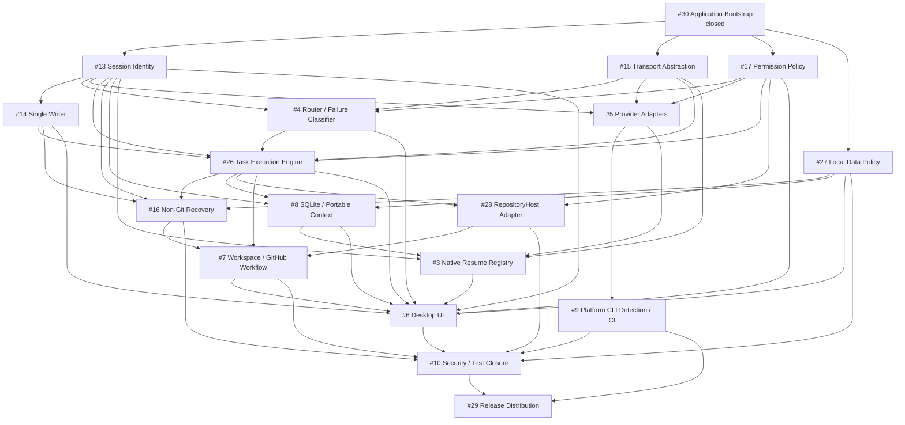

# MVP Dependency Graph

Issue: #39  
Status: Active after merge  
Updated: 2026-10-07

## Purpose

This document is the source of truth for **blocking implementation dependencies** between MVP Issues.

The graph must remain a **directed acyclic graph (DAG)**.

## Dependency semantics

### Prerequisite

A prerequisite is a blocking dependency.

The prerequisite's contract or implementation must exist before the dependent Issue can be completed safely.

Use this section in an Issue:

```text
## Prerequisites
- #13 Session Identity
- #15 Transport Abstraction
```

### Integration follow-up

An integration follow-up is related work that consumes or extends the current Issue later.

It is **not** a blocking dependency for the current Issue and must not be interpreted as an edge in the DAG.

Use this section:

```text
## Integration follow-ups
- #6 Desktop UI
- #10 Security
```

This distinction avoids circular dependencies while still preserving traceability.

## Current blocking DAG



## Implementation layers

### Layer 0 — bootstrap

- #30 Application Bootstrap — **closed**

### Layer 1 — provider-independent contracts

These can proceed in parallel.

- #13 Workspace / Task / Session Identity
- #15 Transport Abstraction
- #17 Unified Permission / Sandbox Policy

### Layer 2 — deterministic primitives

- #14 Single Writer
- #4 Router / Quota / Failure Classifier
- #27 Local Data Privacy Policy

#14 and #4 depend on Layer 1 contracts. #27 is provider-independent and may proceed independently after bootstrap.

### Layer 3 — execution and provider integration

- #26 Task Execution Engine
- #5 Provider Adapters

These may proceed in parallel once their prerequisites exist.

### Layer 4 — recovery, persistence, platform detection

- #16 Non-Git Checkpoint / Crash Recovery
- #8 SQLite / Portable Context
- #9 macOS / Windows CLI Detection / CI

#8 is P0 because it is on the critical path for #3 native resume.

### Layer 5 — resume and repository-host integration

- #3 Native Resume Registry
- #28 GitHub RepositoryHost Adapter

### Layer 6 — workspace workflow

- #7 Local Workspace / GitHub Workflow

### Layer 7 — full desktop integration

- #6 Desktop UI

### Closure / release

- #10 Security / Test / Adversarial Review — continuous, closes after implemented boundaries are tested
- #29 Release Distribution / Signing / Updater / SBOM — P1 during development, release blocker before public production binaries

## Rules for new Issues

Before adding a blocking dependency:

1. classify it as a true prerequisite, not merely related work;
2. check whether the reverse path already exists;
3. do not use a prerequisite edge if the current Issue only needs an interface/contract that it can define itself;
4. use Integration follow-up for later wiring, UI exposure, provider-specific mapping, persistence, or security closure;
5. update this document when a new critical-path Issue changes the graph;
6. run an adversarial dependency review before merge.

## Priority consistency

An Issue that is a required prerequisite of a P0 critical-path Issue should normally not remain P1 unless there is a documented reason.

This audit promoted:

- #8 SQLite / Portable Context: **P1 -> P0**

#9 remains P1 because the bootstrap already provides macOS/Windows build/startup validation; #9 now focuses on provider CLI discovery and platform-specific process behavior.

#29 remains P1 until public production distribution is approaching.

## Ownership

Assignee means the **current implementation owner**, not permanent ownership.

Critical-path Issues are currently assigned to `nntokyo`. If an external contributor takes ownership, the Issue assignee should be updated according to `docs/development-workflow.md`.

## Known integration loops that are not blocking cycles

Some components necessarily integrate in both directions at runtime. These are represented as follow-ups rather than blocking dependencies.

Examples:

- #17 permission contract <-> #5 provider-specific permission mapping
- #4 router <-> #26 execution lifecycle
- #14 writer lease <-> #16 crash recovery
- #27 privacy policy <-> #8 persistence implementation
- #13 identity <-> #8 durable persistence

The contract-owning Issue lands first; the implementation-owning Issue integrates later.

## Adversarial review checklist

Before changing the graph, verify:

- no Issue can reach itself through prerequisite edges;
- no P0 Issue is blocked only by a lower-priority Issue without justification;
- no provider-specific implementation is required to define a provider-independent contract;
- no persistence implementation is required merely to define identity/policy types;
- no UI Issue is a prerequisite for Core behavior;
- Git remains optional;
- GitHub remains optional for Local Workspace Mode;
- release-only work does not block core development;
- security closure remains continuous without creating a circular prerequisite.
