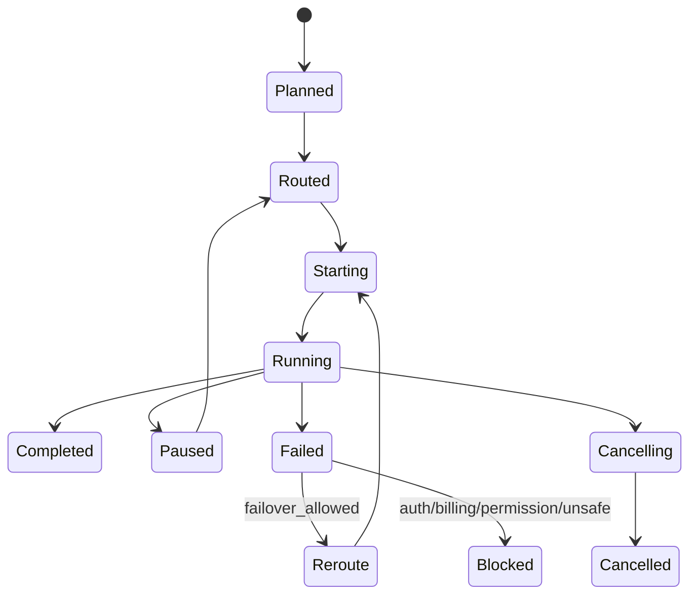

# 詳細設計

Issue: #2  
Parent Epic: #1  
Implementation bootstrap: #30  
Task execution owner: #26  
Status: Accepted for MVP  
Updated: 2026-10-07

## 1. Core domain

### Workspace

```text
Workspace {
  id: UUID
  canonical_path: Path
  display_name: String
  mode: local | git | github
  execution_environment: native_macos | native_windows | wsl
  fingerprint_version: u32
  created_at
  last_opened_at
}
```

canonical_pathはOSのpath semanticsを尊重する。symlink解決はsecurity policyに従う。

### Task

```text
Task {
  id: UUID
  workspace_id: UUID
  title: String
  goal: Text
  status: draft | ready | running | paused | waiting_quota | blocked | review | completed | cancelled
  issue_ref?: String
  branch?: String
  created_at
  updated_at
}
```

### ExecutionRun

```text
ExecutionRun {
  id: UUID
  task_id: UUID
  target_provider: String
  target_model?: String
  target_effort?: String
  transport: String
  provider_session_id?: UUID
  status: planned | routed | starting | running | paused | failed | reroute | cancelling | cancelled | completed | blocked
  started_at?
  finished_at?
  failure_class?
  side_effect_state
}
```

### ProviderSession

```text
ProviderSession {
  id: UUID
  task_id: UUID
  provider: String
  native_session_id: String
  cwd: Path
  model?: String
  effort?: String
  provider_version?: String
  workspace_fingerprint?: String
  git_branch?: String
  git_head?: String
  status: active | resumable | stale | missing | closed
  created_at
  last_used_at
}
```

### RepositoryHostLink

```text
RepositoryHostLink {
  id: UUID
  workspace_id: UUID
  host: github
  repository_owner: String
  repository_name: String
  remote_name: String
  remote_url: String
  upstream_owner?: String
  upstream_name?: String
  auth_state
  permission_state
  last_verified_at
}
```

### LocalDataPolicy

```text
LocalDataPolicy {
  workspace_id: UUID
  event_retention
  log_retention
  checkpoint_retention
  raw_event_storage: disabled | bounded
  redact_secrets: bool
  updated_at
}
```

## 2. Resume validation

resume前:

1. native session existence確認
2. cwd identity確認
3. workspace fingerprint比較
4. Git repositoryならbranch / HEAD比較
5. CLI major capability確認
6. permission policy再評価
7. staleなら差分summaryを生成
8. safety guardを通過後resume

staleだから即破棄はしない。resume可能なら「現在のworkspaceは以前と差分あり」をコンテキストへ注入する。

## 3. Workspace fingerprint

MVP:
- canonical root path
- selected relevant file path list
- mtime/size
- optional fast hash
- Gitの場合HEAD/status digest

大量workspaceで全ファイルhashは行わない。

## 4. Workspace lease

```text
WorkspaceLease {
  workspace_id
  task_id
  run_id
  provider
  mode: read | write
  acquired_at
  heartbeat_at
  owner_process
}
```

規則:
- write leaseはworkspaceあたり1つ
- read leaseは複数可
- write実行中でもUI editorのユーザー編集は許可するがconflict eventを生成
- heartbeat timeout後はstale候補
- OS process存在確認後に回収

## 5. Execution lifecycle



## 6. Provider Adapter interface

概念interface:

```text
detect_binary() -> Detection
probe_version() -> Version
probe_auth() -> AuthState
probe_capabilities() -> CapabilitySet
probe_quota() -> QuotaSnapshot?
create_session(request) -> SessionHandle
resume_session(native_session_id, request) -> SessionHandle
send(session, input) -> EventStream
interrupt(session)
shutdown(session)
classify_vendor_error(raw) -> VendorFailureHint
```

## 7. Transport interface

```text
start(command_spec)
send(frame)
events() -> Stream<TransportEvent>
interrupt()
terminate()
supports_reconnect()
```

Transport selection:
- capability evidenceに基づく
- undocumented interfaceへ依存しない
- fallback時にRouter/Core contractを変えない

## 8. Event normalization

```text
NormalizedEvent =
  assistant_text_delta
  reasoning_status
  tool_call_started
  tool_call_finished
  command_started
  command_output
  file_changed
  permission_requested
  quota_update
  session_metadata
  warning
  error
  completed
```

raw provider eventもdebug retention policyの範囲で参照可能にするが、secret redactionを通す。

## 9. Quota

```text
QuotaSnapshot {
  provider
  scope
  remaining?: number
  limit?: number
  reset_at?: datetime
  window?: duration
  state: available | low | exhausted | unknown
  confidence: authoritative | inferred | manual
  source: status_command | structured_event | stderr | user_config
  fetched_at
}
```

数値が取れないProviderでは無理に推測値を生成しない。

## 10. Routing score

P0では完全なAI最適化はしない。deterministic policyを採用。

Hard filter:
- disabled
- binary missing
- incompatible capability
- auth required
- billing blocked
- permission incompatible
- circuit open

Soft ranking:
1. pinned target
2. resumable current session
3. user priority
4. quota state
5. health
6. switching cost
7. model preference

decisionは全てaudit logへ保存。

## 11. Failure classifier

入力:
- exit code
- normalized event
- stderr
- timeout
- process signal
- quota snapshot
- provider adapter hint
- structured denial / permission notice

分類と挙動:

| Class | Retry | Failover |
|---|---:|---:|
| task_error | no | no |
| tool_error | limited | optional |
| provider_error transient | limited | yes |
| quota_error | no | yes |
| auth_error | no | no |
| billing_error | no | no |
| transport_error | limited | yes |
| permission_error | no | no |
| cancelled | no | no |
| unknown | no | manual/default-safe |

Exit code 0だけを成功判定に使わない。Providerによってはheadless実行でtoolがsoft-denyされてもprocess自体は成功終了し得るため、NormalizedEvent / stderr notice / tool resultを合わせて評価する。

## 12. Checkpoint

write operation前:
- target files推定
- pre-image保存
- journal entry
- write execution
- post-image metadata
- commit journal

対象ファイル不明の場合:
- filesystem watcherを併用
- run中の変更eventを記録

binary/large file:
- size threshold以上はfull copyを避けmetadata + optional explicit snapshot

## 13. Crash recovery

アプリ再起動時:
1. incomplete run検索
2. workspace lease検証
3. child process生存確認
4. journal未完了確認
5. filesystem state検証
6. resume / rollback / abandonを提示

自動rollbackは原則しない。ユーザーまたは安全なpolicyにより選択。

## 14. Permission mapping

Core policyはProvider mappingより強い。

例:
- Core network=deny
- Providerにnetwork単独制御がない
- Providerがwriteとnetworkを一括許可しかできない
- => そのexecution targetはpermission incompatibleとして除外する

「機能がないので許可側へ丸める」は禁止。

## 15. External edits

filesystem watcherで:
- editor
- terminal
- external IDE
- provider CLI

からの変更を検知。

write lease中に未知の外部変更:
- conflict event
- session context stale
- 自動failover前にrevalidate

## 16. GitHub workflow

Gitはoptional capabilityであり、git worktreeは使用しない。

Repository ModeかつGitHub remote:
- RepositoryHostAdapterでremote identityを解決
- fork / upstreamを区別
- repo identity / default branch / issue linkage / current branch / PR linkageをTaskへ保存
- authentication / permission / rate-limit / offline stateをcapabilityとして扱う
- remote mutationはpermission / audit / replay guard対象

Issue/PR automationはGitHub capabilityがない場合、認証が切れた場合、APIが障害中の場合でもCore taskを継続できる。

## 17. Security

- argument vector spawn
- cwd明示
- environment allowlist/redaction
- secret pattern redaction
- untrusted workspace instructionsとsystem policyを分離
- path canonicalization
- external path access guard
- process resource limit
- audit
- no credential persistence
- local history retention/redaction/deletion
- workspace trust for untrusted folders
- RepositoryHost remote-action replay guard

## 18. Test strategy

Unit:
- router
- classifier
- resume validation
- permission mapping
- lease
- quota normalization

Fixture:
- Provider stdout/stderr/event parser

Integration:
- fake CLI executable
- process crash
- quota exhaustion
- stale session
- concurrent writer
- Gitなしrecovery
- soft-denied tool result
- local history deletion/redaction
- RepositoryHost fake integration / remote replay

E2E:
- macOS
- Windows
- local workspace
- GitHub repository workflow

## 19. Version policy

package/CLIの固定バージョンは実装PR作成時に公式最新版を確認しlockfileで固定する。

AdapterはCLI version numberだけではなくcapability probeで互換性を判断する。


## 20. Provider transport baseline

Implementation PR must re-check current official documentation and the installed CLI.

- Codex: official SDK / App Server is the preferred product-integration candidate; structured exec is suitable for bounded automation.
- Claude Code: structured stream-json input/output is preferred over TUI parsing when supported.
- Grok: ACP is the preferred IDE/tool-integration candidate; structured headless mode is fallback.
- Antigravity: persistent stream-json input/output is preferred; structured headless mode is fallback.

Undocumented/private protocols are not stable contracts.

## 21. Local data policy

Prompts, code fragments, command output, file paths, provider events, and checkpoints may contain sensitive information.

The implementation must provide:
- bounded retention;
- secret redaction before durable logs where practical;
- workspace/task history deletion;
- checkpoint garbage collection;
- restricted local file permissions;
- raw provider-event storage that is disabled or bounded by default.

#27 owns the implementation policy.

## 22. Release boundary

Developer build/CI is owned by #9. Production distribution is owned by #29 and must cover signing/notarization, secure update verification, SBOM, third-party license inventory, NOTICE/attribution, and provider-binary redistribution review.
